# ANÁLISE DE MARÉS OCEÂNICAS - LISTA DE EXERCÍCIOS 1

## Informações do Curso

**Curso de pós-graduação:** Oceanografia  
**Área de concentração:** Oceanografia Física  
**Disciplina:** Análise de marés oceânicas – IOC 5801  
**Curso de Especialização:** Medição, Análise, Previsão e Modelagem do Nível do Mar  
**Disciplina:** Método harmônico de análise e previsão do nível do mar  
**Período:** 1º Semestre de 2026  
**Aluno:** Adriano Caversan

---

## Como Executar o Projeto

### **Pré-requisitos**
- **MATLAB R2024a** ou versão superior
- Arquivos de dados: `Cananeia_2020.dat` e `Ubatuba_2020.dat`
- Pasta `plot/` para salvar as imagens geradas

### **Estrutura do Projeto**
```
lista-01/
├── amaroc_L1_adriano_caversan.m    # Script principal
├── Cananeia_2020.dat               # Dados de Cananéia 2020
├── Ubatuba_2020.dat                # Dados de Ubatuba 2020
├── plot/                           # Pasta com todas as imagens geradas
├── data-tmp/                       # Arquivos de dados temporários
└── README.md                       # Este documento
```

### **Instruções de Execução**

1. **Abrir o MATLAB** na pasta do projeto
2. **Executar o script principal:**
   ```matlab
   run('amaroc_L1_adriano_caversan.m')
   ```
3. **Aguardar a execução completa** (aproximadamente 2-3 minutos)
4. **Interagir com as pausas** pressionando qualquer tecla para continuar entre os gráficos

### **Saídas Geradas**

**🔢 Arquivos de dados:**
- `cananeia_2020_estat.dat` - Estatísticas de Cananéia
- `ubatuba_2020_estat.dat` - Estatísticas de Ubatuba

**📊 Gráficos (pasta `plot/`):**
- **Questões 1-6:** 6 gráficos de análise de Cananéia
- **Questões 7-12:** 6 gráficos de análise de Ubatuba  
- **Questões 13-15:** 11 gráficos comparativos entre as estações

**📋 Terminal:** Resultados numéricos das análises estatísticas

### **Tempo de Execução**
- **Análise completa:** ~2-3 minutos
- **15 questões respondidas** automaticamente
- **23 gráficos gerados** na pasta `plot/`

### **Solução de Problemas**
- Se o MATLAB não encontrar os arquivos `.dat`, verifique se estão na mesma pasta do script
- Se houver erro na pasta `plot/`, crie-a manualmente antes da execução
- Para pular as pausas, comente as linhas com `pause` no código

---

## Objetivo Geral

Analisar dados horários de nível do mar de 2020 coletados em duas estações maregráficas do litoral paulista: **Cananéia** e **Ubatuba**. O exercício visa aplicar técnicas estatísticas, análise espectral e correlação para caracterizar o comportamento das marés oceânicas nessas localidades.

---

## QUESTÕES 1-6: ANÁLISE DE CANANÉIA (SP)

### **Questão 1** - Parâmetros Estatísticos Básicos
**Objetivo:** Caracterizar estatisticamente a série temporal de nível do mar.

**Parâmetros calculados:**
- **Média:** Nível médio das águas
- **Desvio padrão:** Variabilidade dos dados
- **Mediana:** Valor central da distribuição  
- **Moda:** Nível mais frequente
- **Mínimo/Máximo:** Extremos observados
- **Curtose:** Achatamento da distribuição
- **Assimetria:** Tendência da distribuição

**Interpretação oceanográfica:** Esses parâmetros fornecem uma visão geral do regime de marés local, incluindo amplitude média, variabilidade e características da distribuição dos níveis d'água.

---

### **Questão 2** - Série Temporal com Desvios e Tendência
**Objetivo:** Visualizar a evolução temporal dos dados e identificar tendências.

**Elementos do gráfico:**
- **Série completa:** Dados horários de 2020
- **Média ± 1σ, ±2σ, ±3σ:** Bandas de desvio padrão
- **Tendência linear:** Taxa de variação anual
- **Eixo temporal:** Escala mensal

**Interpretação oceanográfica:** A tendência indica possível variação do nível médio do mar (subida/descida), enquanto as bandas de desvio mostram a variabilidade natural das marés. A análise permite identificar eventos extremos e padrões sazonais.

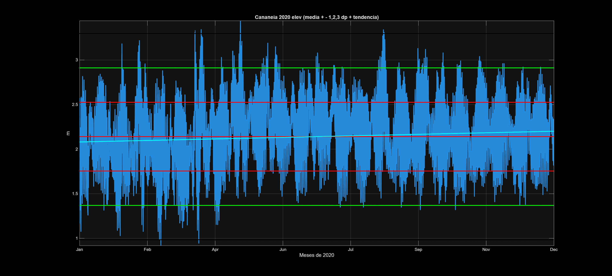
*Figura 2: Série temporal de Cananéia com bandas de desvio padrão e tendência linear*

---

### **Questão 3** - Histograma e Percentis
**Objetivo:** Analisar a distribuição estatística dos dados de nível do mar.

**Análises realizadas:**
- **Histograma:** Frequência de ocorrência por classe
- **Percentis:** 10º, 25º, 75º e 90º percentis
- **Classe modal:** Maior número de observações

**Interpretação oceanográfica:** O histograma revela a forma da distribuição (normal, assimétrica, bimodal), enquanto os percentis indicam os níveis de água associados a diferentes probabilidades de ocorrência, úteis para estudos de inundação e ressacas.

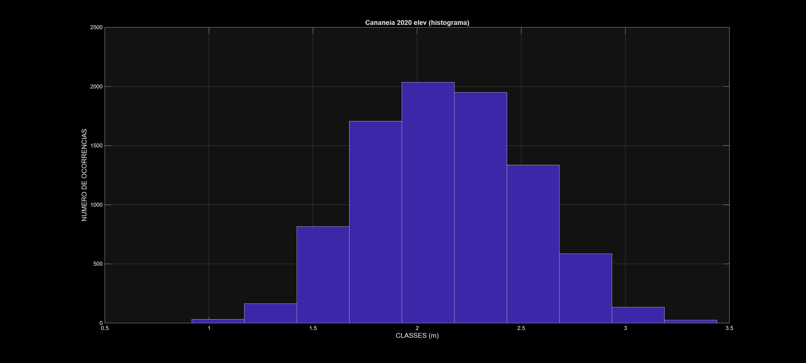
*Figura 3: Histograma de frequências do nível do mar em Cananéia*

---

### **Questão 4** - Análise de Percentis Detalhada
**Objetivo:** Caracterizar completamente a distribuição probabilística dos dados.

**Análise:** Curva de percentis de 0% a 100% mostrando a função de distribuição acumulada.

**Interpretação oceanográfica:** Permite determinar probabilidades de excedência para níveis críticos e estabelecer critérios para alerta de marés meteorológicas e eventos extremos.

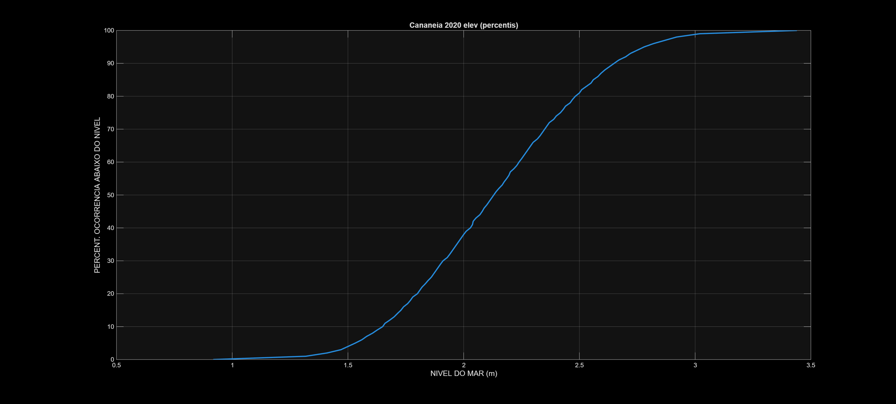
*Figura 4: Curva de percentis do nível do mar em Cananéia*

---

### **Questão 5** - Análise de Fourier (Análise Espectral)
**Objetivo:** Identificar componentes harmônicas das marés.

**Resultados fornecidos:**
- **5 maiores amplitudes:** Principais constituintes de maré
- **Períodos correspondentes:** Em dias (ex: ~0.5 dias para M2)
- **Frequências angulares:** Em rad/dia

**Interpretação oceanográfica:** Os picos espectrais revelam as principais constituintes harmônicas das marés (M2, S2, K1, O1, etc.). Períodos próximos a 0.5 dias indicam marés semidiurnas, enquanto períodos de ~1 dia indicam marés diurnas.

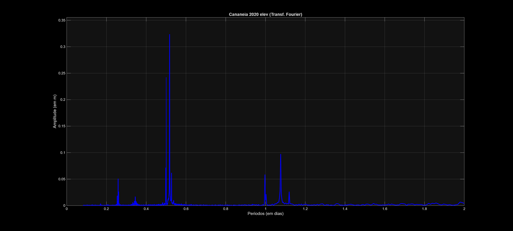
*Figura 5: Análise espectral (Fourier) do nível do mar em Cananéia*

---

### **Questão 6** - Médias e Variabilidade Mensais
**Objetivo:** Identificar padrões sazonais no comportamento das marés.

**Análises:**
- **Médias mensais:** Nível médio por mês
- **Desvios padrão mensais:** Variabilidade por mês
- **Identificação de extremos:** Meses com maior/menor média e variabilidade

**Interpretação oceanográfica:** Variações sazonais podem indicar influência de fatores meteorológicos, mudanças na circulação oceânica regional, ou efeitos de larga escala como El Niño/La Niña.

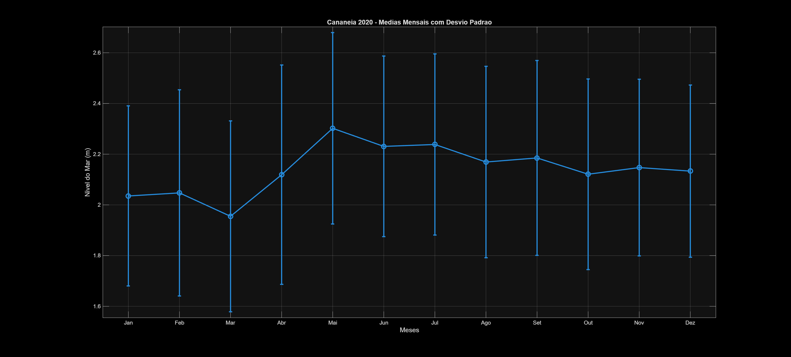
*Figura 6: Médias mensais com desvios padrão - Cananéia*

---

## QUESTÕES 7-12: ANÁLISE DE UBATUBA (SP)

As questões 7-12 repetem exatamente as mesmas análises das questões 1-6, porém aplicadas aos dados de Ubatuba. Isso permite comparação direta entre as características das marés nas duas localidades do litoral paulista.

**Localização geográfica:**
- **Cananéia:** Litoral Sul de SP, região estuarina
- **Ubatuba:** Litoral Norte de SP, costa aberta

### **Comparação Visual das Análises**

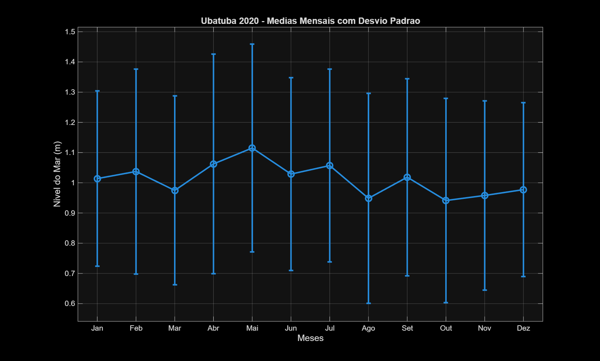
*Figura 7: Médias mensais com desvios padrão - Ubatuba*

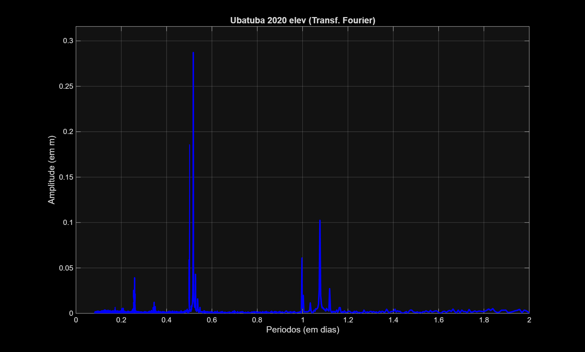
*Figura 8: Análise espectral (Fourier) do nível do mar em Ubatuba*

---

## QUESTÕES 13-15: ANÁLISE COMPARATIVA

### **Questão 13** - Comparação Mensal das Estatísticas
**Objetivo:** Comparar visualmente o comportamento mensal entre as duas estações.

**8 Gráficos comparativos gerados:**
1. **Médias mensais:** Nível médio por mês
2. **Desvios padrão:** Variabilidade mensal  
3. **Medianas mensais:** Valores centrais
4. **Modas mensais:** Valores mais frequentes
5. **Mínimos mensais:** Menores valores mensais
6. **Máximos mensais:** Maiores valores mensais  
7. **Curtoses mensais:** Achatamento das distribuições
8. **Assimetrias mensais:** Tendências das distribuições

**Interpretação oceanográfica:** Permite identificar se as duas estações apresentam sazonalidade similar ou comportamentos distintos, indicando influências locais versus regionais.

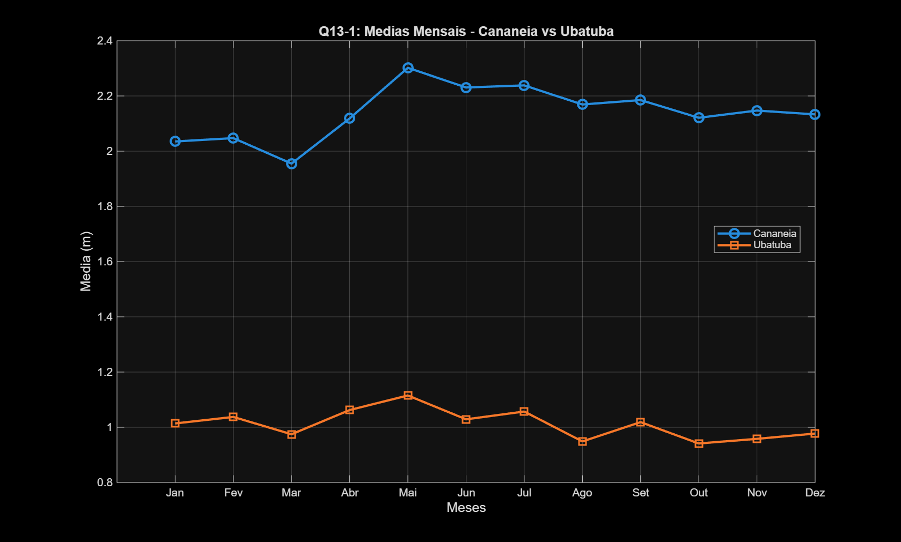
*Figura 9: Comparação das médias mensais entre Cananéia e Ubatuba*

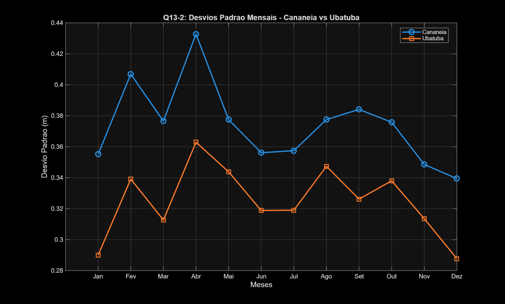
*Figura 10: Comparação dos desvios padrão mensais*

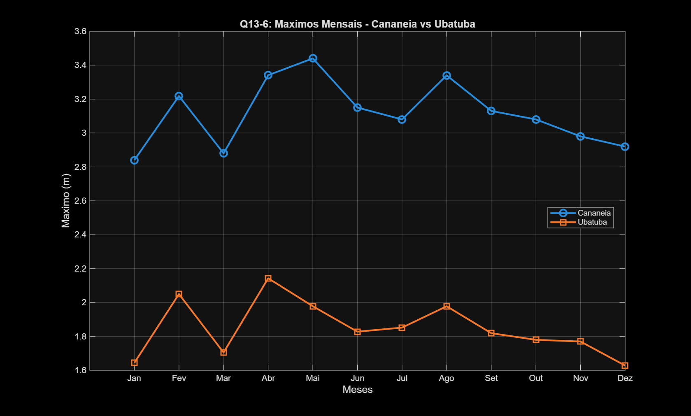
*Figura 11: Comparação dos máximos mensais*

---

### **Questão 14** - Correlação e Parâmetros Estatísticos
**Objetivo:** Quantificar a relação linear entre as séries de Cananéia e Ubatuba.

**Dois gráficos gerados:**

**A) Diagrama de Espalhamento (Dados Mensais):**
- **Eixo X:** Médias mensais de Cananéia
- **Eixo Y:** Médias mensais de Ubatuba  
- **Linhas de referência:** Regressão linear e linha 1:1
- **Parâmetros mostrados no gráfico:**
  - **R²:** Coeficiente de determinação
  - **r:** Coeficiente de correlação  
  - **MAE:** Erro médio absoluto
  - **MARE:** Erro médio absoluto relativo
  - **d:** Índice de concordância (Willmott)

**B) Gráfico de Barras dos Parâmetros:**
- Visualização normalizada dos 5 parâmetros
- Valores reais sobre cada barra

**Interpretação oceanográfica:** 
- **R² > 0.9:** Forte correlação, comportamento similar
- **MAE baixo:** Diferenças pequenas entre estações
- **Índice de concordância próximo a 1:** Boa concordância temporal

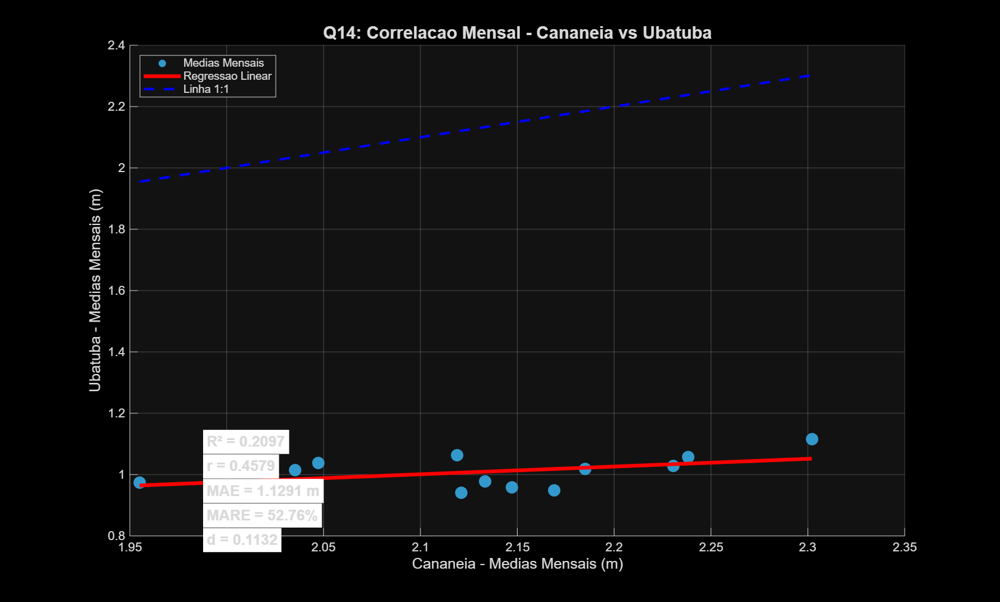
*Figura 12: Diagrama de espalhamento - correlação entre médias mensais*

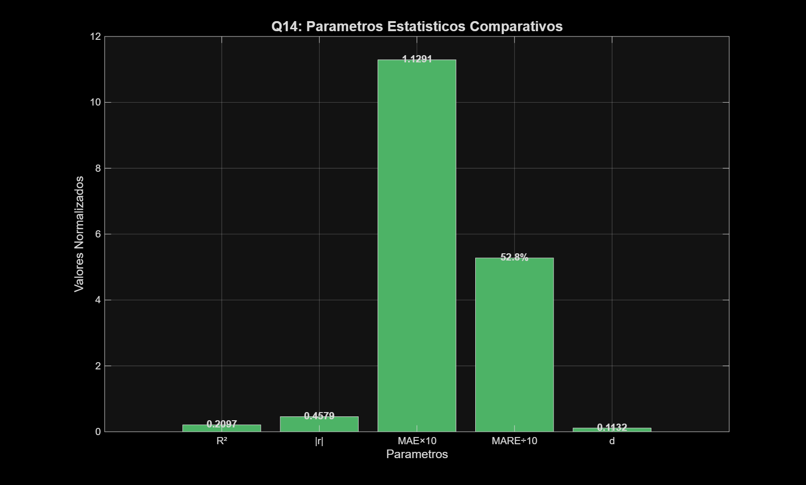
*Figura 13: Parâmetros estatísticos comparativos em formato de barras*

---

### **Questão 15** - Correlação Cruzada com Defasagens
**Objetivo:** Identificar sincronismo temporal e possíveis atrasos entre as séries.

**Análise realizada:**
- **Correlação cruzada:** Função xcorr com defasagens de ±48 horas
- **Identificação da máxima correlação:** Valor e defasagem correspondente
- **Interpretação automática:** Qual série lidera/atrasa

**Gráfico gerado:**
- **Eixo X:** Defasagens em horas (-48 a +48)
- **Eixo Y:** Coeficientes de correlação  
- **Ponto destacado:** Máxima correlação
- **Informações no gráfico:** Valor máximo, defasagem e interpretação

**Interpretação oceanográfica:**
- **Defasagem ≈ 0:** Séries em fase (propagação instantânea)
- **Defasagem > 0:** Ubatuba atrasa (onda se propaga de Cananéia para Ubatuba)
- **Defasagem < 0:** Cananéia atrasa (onda se propaga de Ubatuba para Cananéia)

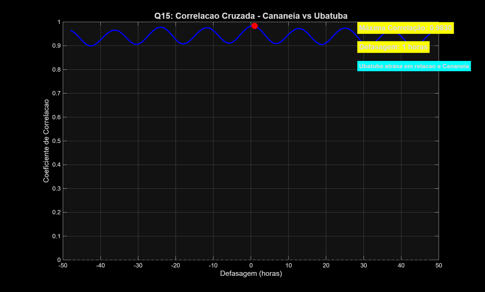
*Figura 14: Correlação cruzada com defasagens temporais*

---

## PRINCIPAIS ARQUIVOS GERADOS

### **Dados Estatísticos:**
- `cananeia_2020_estat.dat` - Estatísticas básicas de Cananéia
- `ubatuba_2020_estat.dat` - Estatísticas básicas de Ubatuba

### **Gráficos de Cananéia (Q1-Q6):**
- `cananeia_2020_elev_dp.png` - Série temporal com desvios
- `cananeia_2020_elev_hist.png` - Histograma  
- `cananeia_2020_elev_perc.png` - Percentis
- `cananeia_2020_elev_tend.png` - Tendência
- `cananeia_2020_elev_fourier.png` - Análise espectral
- `cananeia_2020_medias_mensais.png` - Médias mensais

### **Gráficos de Ubatuba (Q7-Q12):**
- `ubatuba_2020_elev_dp.png` - Série temporal com desvios
- `ubatuba_2020_elev_hist.png` - Histograma
- `ubatuba_2020_elev_perc.png` - Percentis  
- `ubatuba_2020_elev_tend.png` - Tendência
- `ubatuba_2020_elev_fourier.png` - Análise espectral
- `ubatuba_2020_medias_mensais.png` - Médias mensais

### **Gráficos Comparativos (Q13-Q15):**
- `q13_1_medias_mensais.png` até `q13_8_assimetrias_mensais.png` - 8 comparações mensais
- `q14_correlacao_mensal.png` - Correlação entre estações
- `q14_parametros_estatisticos.png` - Parâmetros em barras  
- `q15_correlacao_cruzada.png` - Correlação cruzada com defasagens

---

## CONSIDERAÇÕES TÉCNICAS

### **Formato dos Dados:**
- **Colunas:** Ano, Mês, Dia, Hora, Minuto, Segundo, Nível do Mar (m)
- **Frequência:** Horária
- **Período:** Ano completo de 2020
- **Pré-processamento:** Remoção de médias antes da análise espectral

### **Ferramentas Utilizadas:**
- **MATLAB R2024a** - Ambiente de programação
- **Funções estatísticas:** mean, std, median, mode, kurtosis, skewness
- **Análise espectral:** fft (Fast Fourier Transform)
- **Correlação:** corrcoef, xcorr
- **Visualização:** plot, scatter, bar, hist, errorbar

### **Metodologia:**
- **Análise individual:** Caracterização completa de cada estação
- **Análise comparativa:** Identificação de similaridades e diferenças  
- **Análise temporal:** Correlações cruzadas e defasagens
- **Interpretação física:** Contextualização oceanográfica dos resultados

---

## CONCLUSÕES ESPERADAS

A análise completa permite:

1. **Caracterizar o regime de marés** local de cada estação
2. **Identificar constituintes harmônicas** dominantes
3. **Quantificar a correlação** entre as estações  
4. **Determinar sincronismo temporal** e possíveis atrasos
5. **Avaliar influências sazonais** no comportamento das marés
6. **Comparar características** entre litoral norte e sul de SP

Os resultados contribuem para o entendimento da dinâmica das marés no litoral paulista e fornecem subsídios para estudos de oceanografia física, modelagem costeira e gerenciamento de zonas costeiras.

---

*Relatório gerado automaticamente pelo sistema de análise de marés oceânicas - IOC 5801*