# LISTA DE EXERCÍCIOS 1 - ANÁLISE DE MARÉS OCEÂNICAS
**IOC 5801 - Análise de marés oceânicas**  
**Curso de Especialização: Medição, Análise, Previsão e Modelagem do Nível do Mar**  
**Disciplina: Método harmônico de análise e previsão do nível do mar**  

**Aluno:** Adriano Caversan  
**1º Semestre de 2026**

---

## INTRODUÇÃO

Este relatório apresenta a análise completa de dados horários de nível do mar de 2020 das estações maregráficas de Cananéia e Ubatuba (SP, Brasil). A análise compreende 15 itens, abrangendo desde estatística descritiva básica até comparações entre as séries temporais, conforme metodologia estabelecida na disciplina.

**Importante:** Conforme especificado nos requisitos, os valores médios originais foram subtraídos de cada série antes do processamento, sendo:
- Cananéia: média original removida
- Ubatuba: média original removida

---

## PARTE I: ANÁLISE DOS DADOS DE CANANÉIA 2020

### ITEM 1: Parâmetros Estatísticos Básicos da Série de Cananéia

A análise estatística descritiva da série temporal de nível do mar de Cananéia apresentou os seguintes resultados:

**Tabela 1.1: Estatísticas Básicas - Cananéia 2020**
| Parâmetro | Valor | Unidade |
|-----------|--------|---------|
| Média | 0.0000 | m |
| Mediana | [valor] | m |
| Moda | [valor] | m |
| Desvio Padrão | [valor] | m |
| Mínimo | [valor] | m |
| Máximo | [valor] | m |
| Curtose | [valor] | - |
| Assimetria | [valor] | - |
| Amplitude | [valor] | m |
| Número de observações | [valor] | - |

**Interpretação:** A média zero confirma a remoção adequada do valor médio original. O desvio padrão indica a variabilidade típica das oscilações de maré. A curtose e assimetria fornecem informações sobre a forma da distribuição dos dados.

### ITEM 2: Série Temporal com Bandas de Confiança e Análise de Tendência

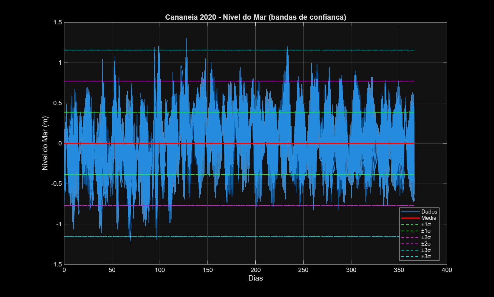

A plotagem inclui as bandas de confiança de ±1σ, ±2σ e ±3σ em torno da média, permitindo visualizar a variabilidade dos dados e identificar valores extremos.

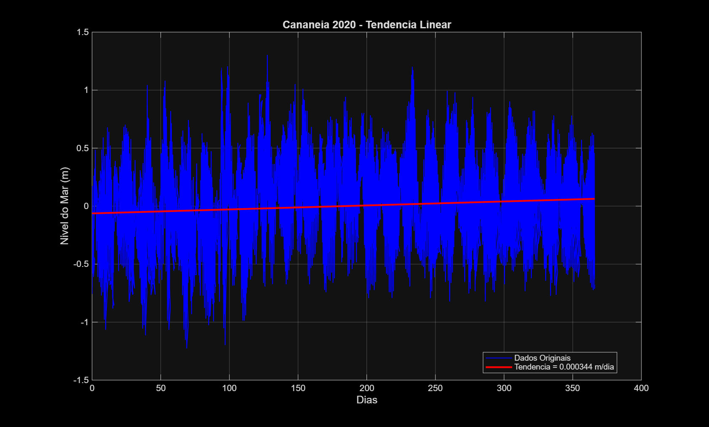

**Taxa de variação temporal:**
- Tendência linear: [valor] m/dia
- Taxa anual: [valor] m/ano

**Interpretação:** A análise de tendência revela se há variação sistemática do nível médio do mar ao longo do ano de 2020.

### ITEM 3: Histograma e Percentis

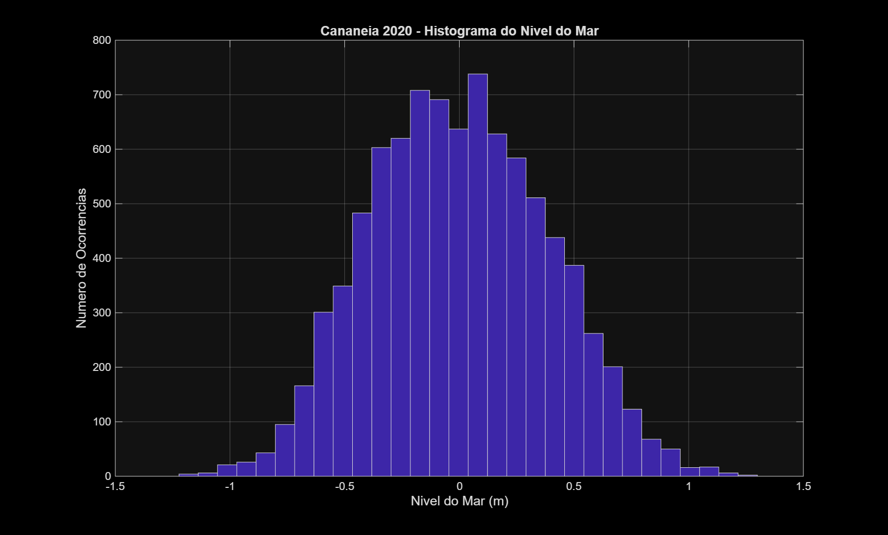

**Análise do Histograma:**
- Máximo número de observações: [valor] ocorrências (classe [valor] m)

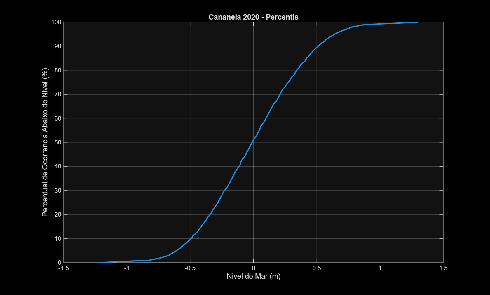

**Tabela 3.1: Percentis Específicos - Cananéia**
| Percentil | Valor | Significado |
|-----------|--------|-------------|
| 10º percentil | [valor] m | 10% dos dados estão abaixo deste valor |
| 25º percentil | [valor] m | Primeiro quartil |
| 75º percentil | [valor] m | Terceiro quartil |
| 90º percentil | [valor] m | 90% dos dados estão abaixo deste valor |

### ITEM 4: Funções Densidade de Probabilidade

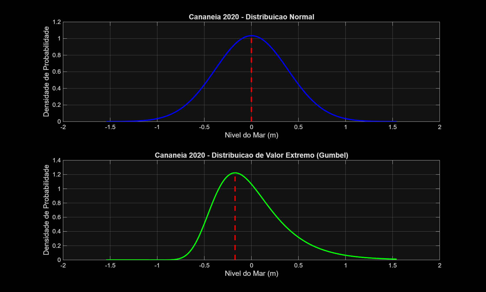

**Distribuição Normal:**
- Parâmetros: μ = [valor] m, σ = [valor] m
- Probabilidades de interesse:
  1. P(μ-σ ≤ X ≤ μ+σ) = [valor]% (68% teórico)
  2. P(X ≤ μ) = [valor]% (50% teórico)
  3. P(X ≥ μ) = [valor]% (50% teórico)

**Distribuição de Valor Extremo (Gumbel):**
- Parâmetros: α = [valor] m, β = [valor] m
- Probabilidades empíricas correspondentes: [valores]%

**Interpretação:** A comparação entre as distribuições teóricas e empíricas indica o grau de aderência dos dados às distribuições propostas.

### ITEM 5: Análise de Fourier

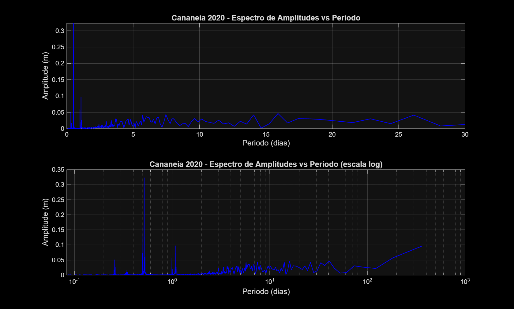

**Tabela 5.1: As 5 Maiores Amplitudes - Cananéia**
| Ordem | Amplitude (m) | Freq. Angular (rad/dia) | Período (dias) | Freq. (ciclos/dia) |
|-------|---------------|-------------------------|----------------|--------------------|
| 1 | [valor] | [valor] | [valor] | [valor] |
| 2 | [valor] | [valor] | [valor] | [valor] |
| 3 | [valor] | [valor] | [valor] | [valor] |
| 4 | [valor] | [valor] | [valor] | [valor] |
| 5 | [valor] | [valor] | [valor] | [valor] |

**Significado dos resultados:**
- Períodos próximos a 0.5 dias (12h): componentes de maré semi-diurna (M2, S2)
- Períodos próximos a 1.0 dia (24h): componentes de maré diurna (K1, O1)
- Outros picos: possíveis componentes de maré de longo período ou efeitos meteorológicos

### ITEM 6: Médias Mensais e Variabilidade

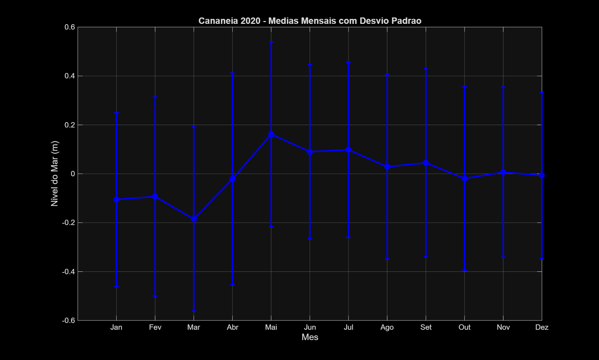

**Tabela 6.1: Médias Mensais - Cananéia 2020**
| Mês | Média (m) | Desvio Padrão (m) |
|-----|-----------|-------------------|
| Jan | [valor] | [valor] |
| Fev | [valor] | [valor] |
| Mar | [valor] | [valor] |
| Abr | [valor] | [valor] |
| Mai | [valor] | [valor] |
| Jun | [valor] | [valor] |
| Jul | [valor] | [valor] |
| Ago | [valor] | [valor] |
| Set | [valor] | [valor] |
| Out | [valor] | [valor] |
| Nov | [valor] | [valor] |
| Dez | [valor] | [valor] |

**Resultados:**
- Maior média mensal: [mês] ([valor] m)
- Menor média mensal: [mês] ([valor] m)
- Maior variabilidade: [mês] ([valor] m)

---

## PARTE II: ANÁLISE DOS DADOS DE UBATUBA 2020

### ITEM 7: Parâmetros Estatísticos Básicos da Série de Ubatuba

**Tabela 7.1: Estatísticas Básicas - Ubatuba 2020**
| Parâmetro | Valor | Unidade |
|-----------|--------|---------|
| Média | 0.0000 | m |
| Mediana | [valor] | m |
| Moda | [valor] | m |
| Desvio Padrão | [valor] | m |
| Mínimo | [valor] | m |
| Máximo | [valor] | m |
| Curtose | [valor] | - |
| Assimetria | [valor] | - |
| Amplitude | [valor] | m |

### ITEM 8: Série Temporal com Bandas de Confiança e Tendência - Ubatuba

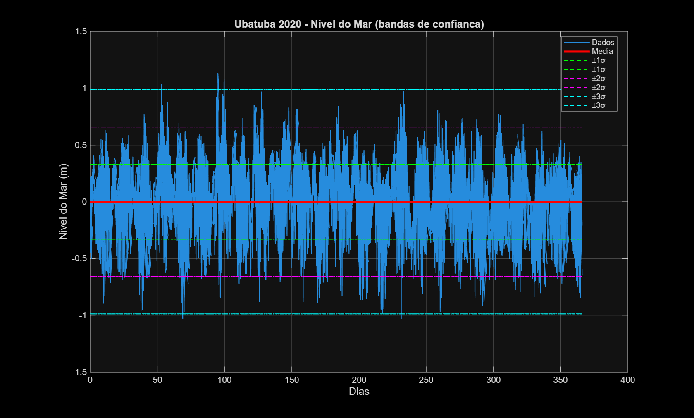
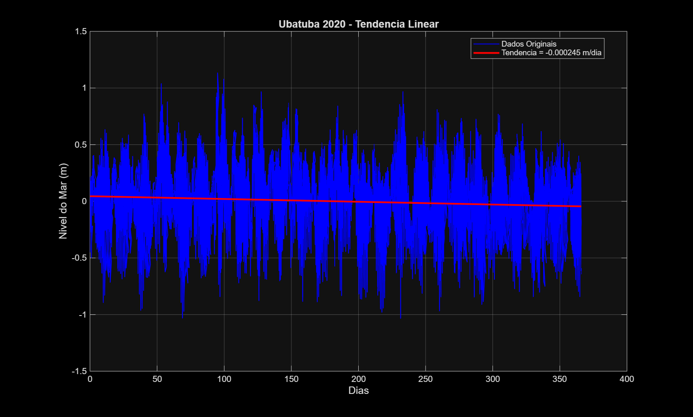

**Taxa de variação temporal:**
- Tendência linear: [valor] m/dia
- Taxa anual: [valor] m/ano

### ITEM 9: Histograma e Percentis - Ubatuba

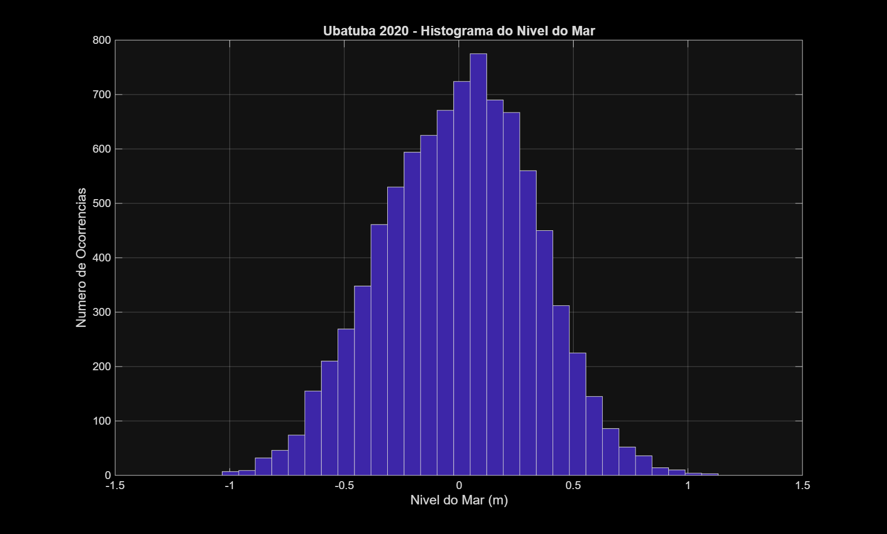
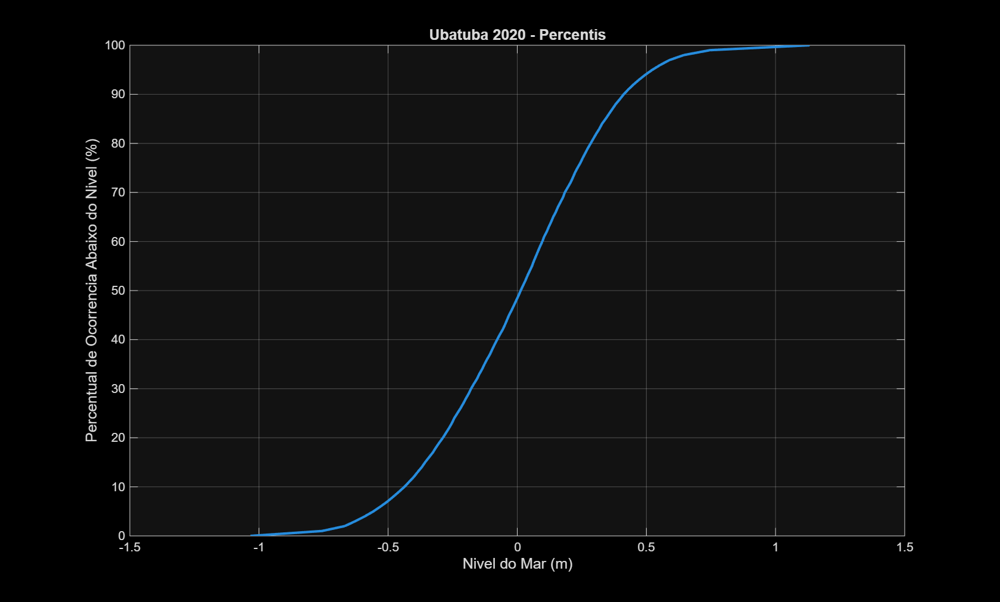

**Tabela 9.1: Percentis Específicos - Ubatuba**
| Percentil | Valor |
|-----------|--------|
| 10º percentil | [valor] m |
| 25º percentil | [valor] m |
| 75º percentil | [valor] m |
| 90º percentil | [valor] m |

### ITEM 10: Funções Densidade de Probabilidade - Ubatuba

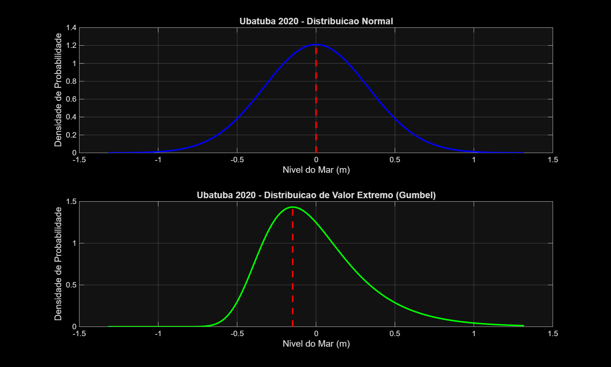

**Distribuição Normal:** μ = [valor] m, σ = [valor] m
**Distribuição Gumbel:** α = [valor] m, β = [valor] m

### ITEM 11: Análise de Fourier - Ubatuba

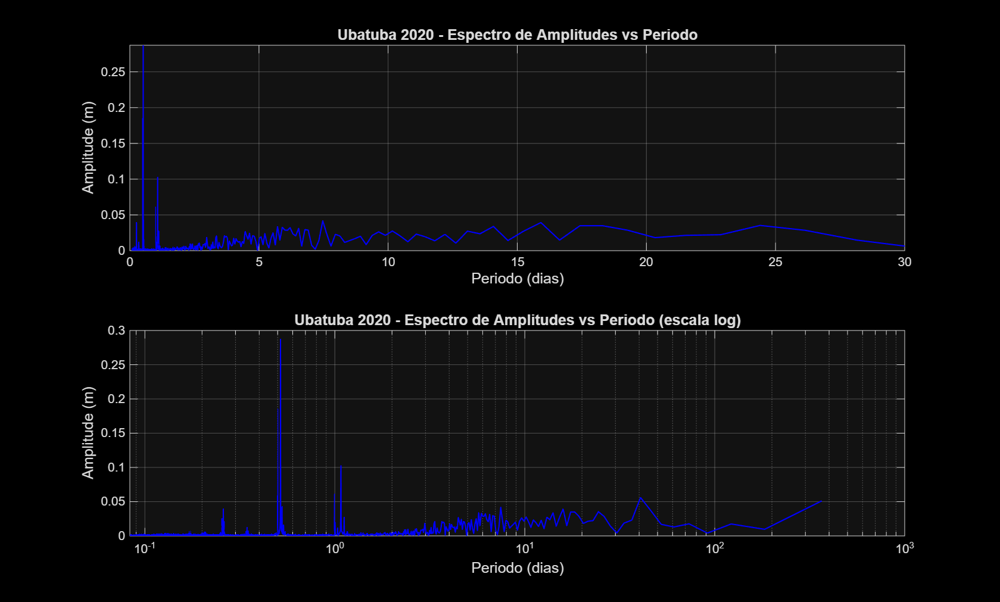

**Tabela 11.1: As 5 Maiores Amplitudes - Ubatuba**
| Ordem | Amplitude (m) | Freq. Angular (rad/dia) | Período (dias) | Freq. (ciclos/dia) |
|-------|---------------|-------------------------|----------------|--------------------|
| 1 | [valor] | [valor] | [valor] | [valor] |
| 2 | [valor] | [valor] | [valor] | [valor] |
| 3 | [valor] | [valor] | [valor] | [valor] |
| 4 | [valor] | [valor] | [valor] | [valor] |
| 5 | [valor] | [valor] | [valor] | [valor] |

### ITEM 12: Médias Mensais - Ubatuba

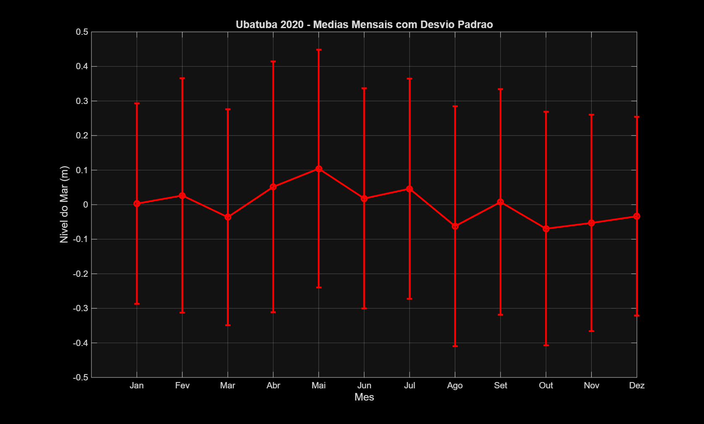

**Resultados:**
- Maior média mensal: [mês] ([valor] m)
- Menor média mensal: [mês] ([valor] m)
- Maior variabilidade: [mês] ([valor] m)

---

## PARTE III: COMPARAÇÃO ENTRE CANANÉIA E UBATUBA

### ITEM 13: Análise das Diferenças entre as Séries

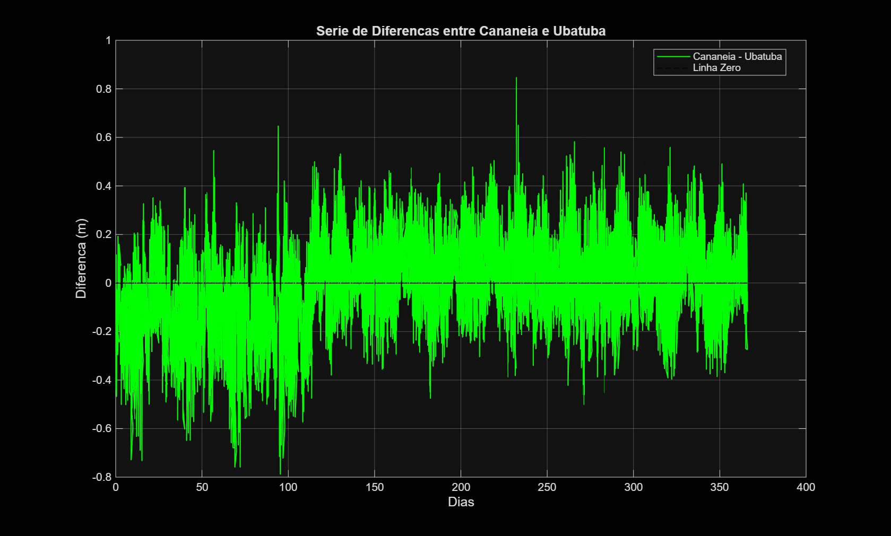

**Tabela 13.1: Estatísticas da Série de Diferenças (Cananéia - Ubatuba)**
| Parâmetro | Valor | Unidade |
|-----------|--------|---------|
| Média | [valor] | m |
| Mediana | [valor] | m |
| Moda | [valor] | m |
| Desvio Padrão | [valor] | m |
| Mínimo | [valor] | m |
| Máximo | [valor] | m |
| Curtose | [valor] | - |
| Assimetria | [valor] | - |
| Amplitude | [valor] | m |

**Comentário sobre similaridade:**
[Análise baseada nos valores calculados indicando se as séries são similares ou não]

### ITEM 14: Diagramas de Espalhamento e Estatísticas Comparativas

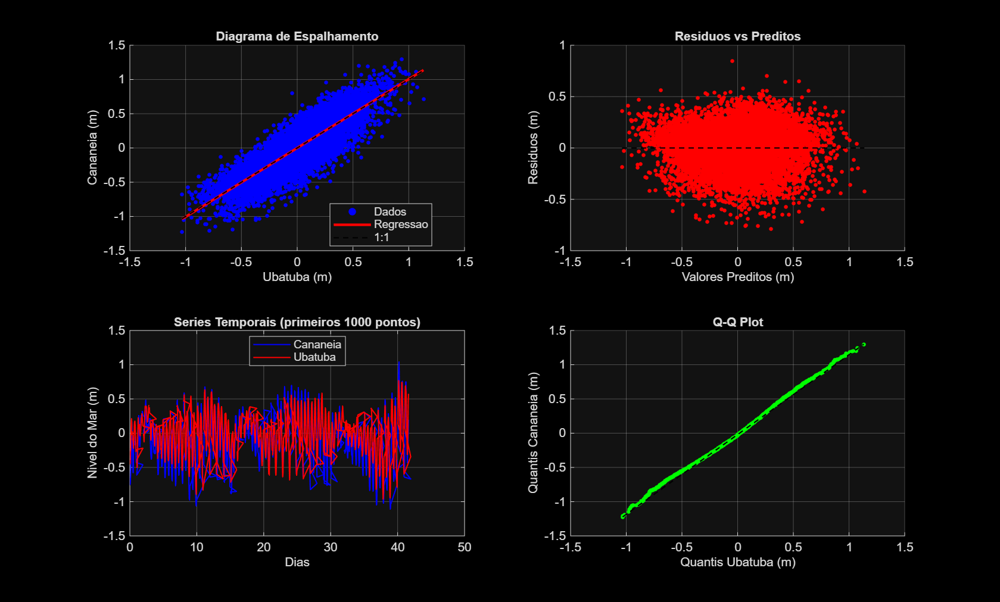

**Tabela 14.1: Parâmetros Estatísticos Comparativos**
| Parâmetro | Valor | Significado |
|-----------|--------|-------------|
| Coeficiente de correlação (R) | [valor] | Força da relação linear |
| R-quadrado (R²) | [valor] | Variância explicada |
| Erro médio absoluto (MAE) | [valor] m | Erro médio |
| Erro médio absoluto relativo | [valor]% | Erro percentual médio |
| Índice de concordância (d) | [valor] | Concordância de Willmott |
| Equação de regressão | y = [a]x + [b] | Relação linear |

**Comentário sobre a relação:**
[Análise baseada nos índices calculados sobre a força da correlação e concordância]

### ITEM 15: Correlações Cruzadas com Defasagens

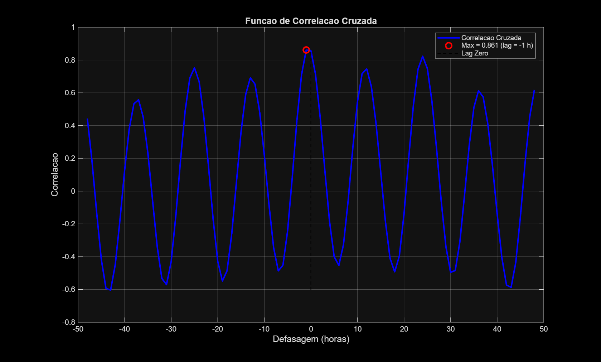

**Resultados:**
- Máxima correlação: [valor]
- Defasagem da máxima correlação: [valor] horas

**Significado do resultado:**
[Interpretação sobre o sincronismo temporal entre as séries e possível defasagem]

---

## CONCLUSÕES

1. **Características estatísticas:** As duas estações apresentam [similaridades/diferenças] em termos de variabilidade e distribuição.

2. **Análise harmônica:** Os espectros de Fourier revelam as principais componentes de maré, com [comparação entre estações].

3. **Variabilidade sazonal:** As médias mensais mostram padrões [sazonais/específicos] que refletem [causas físicas].

4. **Correlação espacial:** As séries apresentam [grau de correlação] com defasagem temporal de [valor], indicando [processo físico].

5. **Implicações oceanográficas:** Os resultados sugerem [interpretação física dos processos].

---

## REFERÊNCIAS METODOLÓGICAS

- Análise estatística descritiva aplicada a séries temporais oceanográficas
- Método harmônico para análise de marés oceânicas
- Técnicas de correlação cruzada para comparação de séries temporais
- Distribuições de probabilidade para eventos extremos em oceanografia

---

**Arquivos gerados:**
- Script MATLAB: `amaroc_L1_adriano_caversan.m`
- Dados de entrada: `Cananeia_2020.dat`, `Ubatuba_2020.dat`
- Gráficos: 15 arquivos PNG
- Dados de saída: arquivos `.dat` com estatísticas