# Lista 2 — Análise Harmônica de Marés Oceânicas

**Disciplina:** Análise de Marés Oceânicas — IOC 5801 / Especialização AMAROC  
**Aluno:** Adriano Caversan  
**Período:** 1º Semestre de 2026  
**Entrega:** 02 de junho de 2026

---

## Dados utilizados

| Arquivo | Localização | Período | Intervalo | Colunas |
|---------|-------------|---------|-----------|---------|
| `Cananeia_2020.dat` | `lista-original/` | 2020 (1 ano) | 1 hora | ano mes dia hora min seg nível(m) |
| `Ubatuba_2020.dat` | `lista-original/` | 2020 (1 ano) | 1 hora | ano mes dia hora min seg nível(m) |
| `adp_0m.dat` | `lista-original/` | jan 2009 (~38 dias) | 30 min | ano mes dia hora min seg nível(cm) temp(°C) EW(cm/s) NS(cm/s) |

Coordenadas: Cananéia 25°01,0'S 47°55,5'W · Ubatuba 23°30,0'S 45°07,3'W · Santos 24°0,757'S 46°19,579'W

**Pré-processamento:** média de cada série foi subtraída antes de qualquer análise, conforme instrução da lista.

| Estação | Média subtraída |
|---------|----------------|
| Cananéia | 2,1404 m |
| Ubatuba | 1,0109 m |
| Santos — nível | 0,0000 m |
| Santos — EW | −0,0447 m/s |
| Santos — NS | 0,0056 m/s |

---

## Parte 1 — Cananéia 2020

---

### Questão 1 — Série temporal, análise de maré e previsão

> Plotar a série temporal, efetuar a análise de maré e uma previsão de maré para o período de observações.

**Metodologia:** análise harmônica via toolbox `t_tide` (Pawlowicz et al. 2002), intervalo de 1 hora, latitude −25,017°, correções nodais aplicadas, critério de Rayleigh = 1, SNR mínimo = 2.

**Resultados da análise harmônica:**
- 67 constituintes utilizadas
- 8783 de 8784 pontos aproveitados
- Variância residual após ajuste: **20,80%** (ou seja, a maré explica **79,20%** da variância total do nível do mar em Cananéia)
- Variância residual após síntese (SNR ≥ 2): **21,39%**

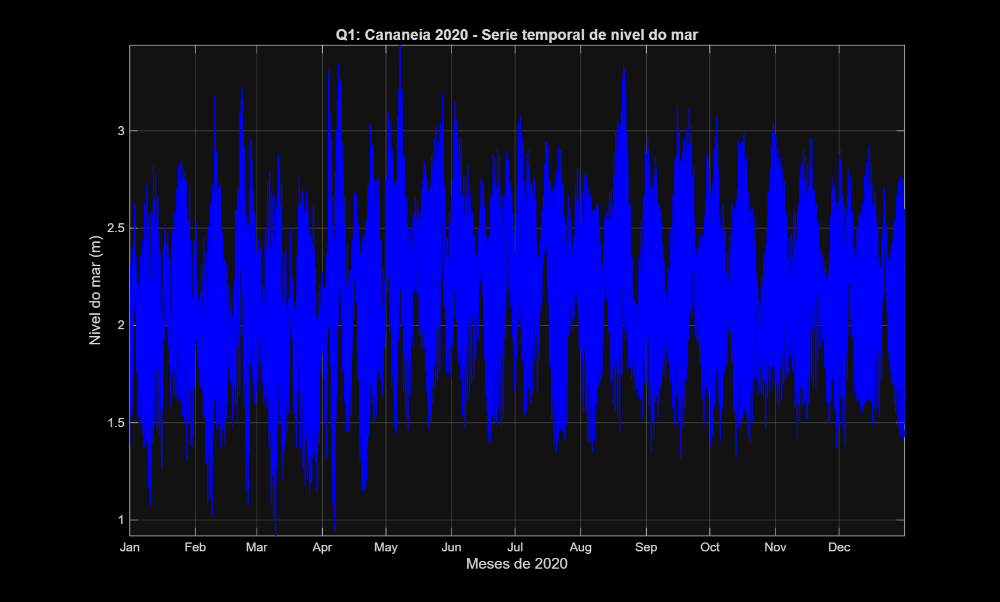

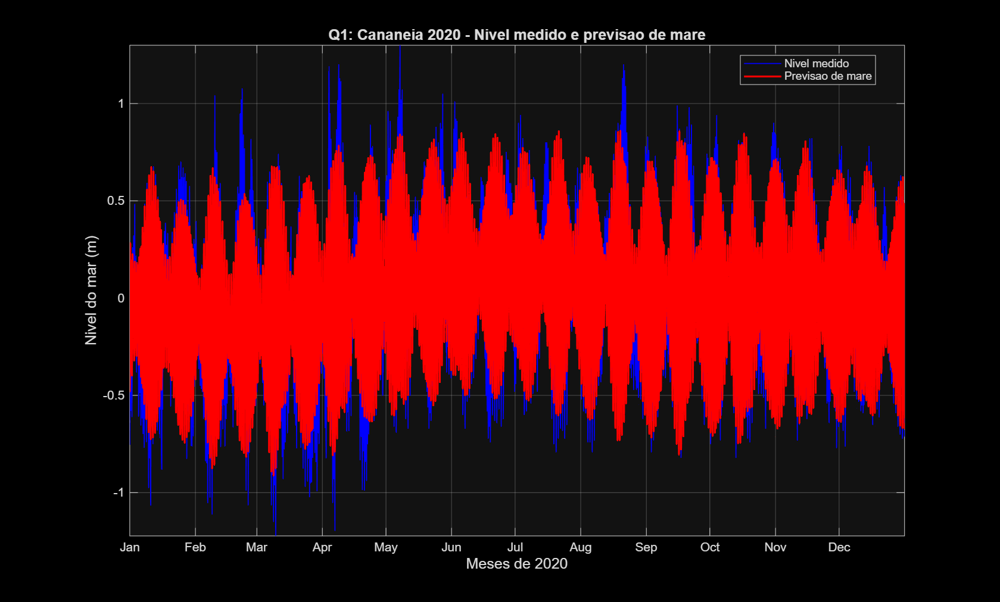

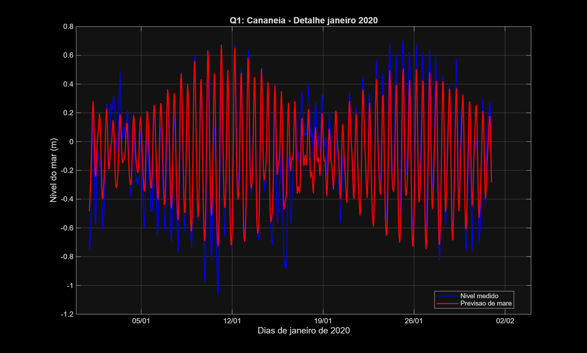

**Comentário:** A previsão de maré acompanha bem o sinal medido, evidenciando o caráter predominantemente semidiurno das marés em Cananéia. A variância não explicada (~21%) corresponde ao sinal meteorológico (maré meteorológica), ressacas e variações de baixa frequência.

---

### Questão 2 — Série residual e análise espectral

> Plotar a série residual (medições menos previsão) e aplicar as análises estatística e espectral (FFT). Comentar os resultados obtidos.

**Estatística do residual:**

| Parâmetro | Valor |
|-----------|-------|
| Média | 0,0003 m |
| Mediana | −0,0170 m |
| Desvio padrão | 0,1783 m |
| Mínimo | −0,6019 m |
| Máximo | 0,8614 m |
| Curtose | 4,0979 |
| Assimetria | 0,6563 |

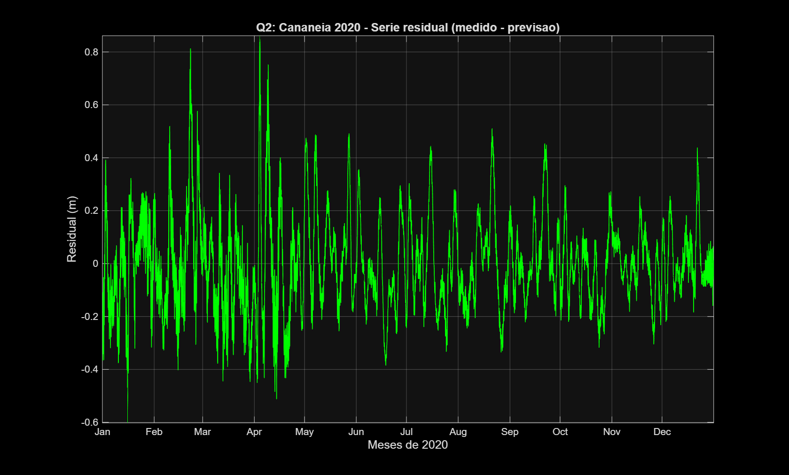

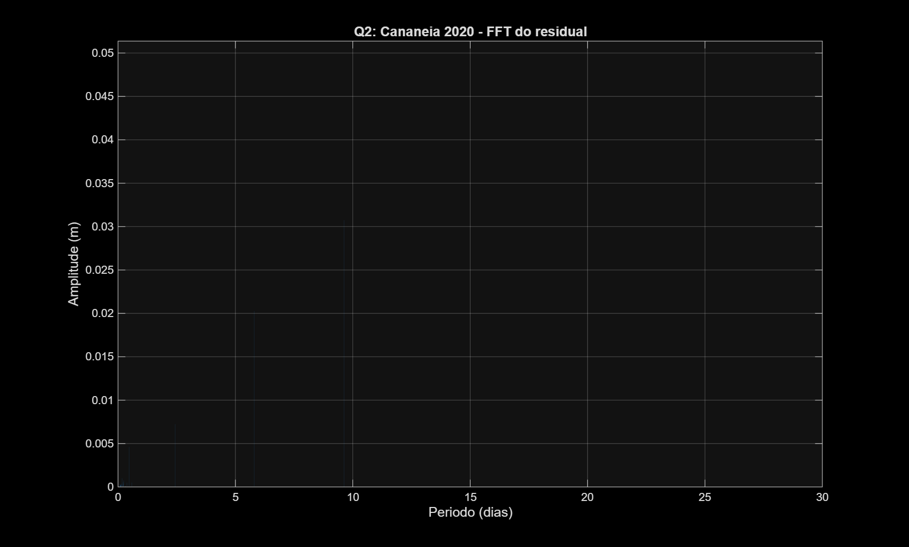

**Comentário:** O residual apresenta desvio padrão de 0,178 m, indicando forçamento meteorológico relevante. A assimetria positiva (0,66) e a curtose elevada (4,10) evidenciam eventos de nível elevado (ressacas, ondas de tempestade) mais extremos do que eventos de nível baixo. O espectro FFT do residual mostra energia concentrada em períodos de dias a semanas (banda meteorológica), sem picos de maré residuais significativos, confirmando a qualidade da análise harmônica.

---

### Questão 3 — Nível médio do mar (filtro S24S25S25)

> Plotar a série horária de nível médio do mar, calculada através da aplicação do filtro de médias móveis S24S25S25 (onde Sn é a média de n dados) e aplicar as análises estatística e espectral (FFT). Comentar os resultados obtidos.

**Metodologia:** filtro aplicado em três etapas sequenciais (S24 → S25 → S25), cada Sn centrada no ponto calculado. Bordas preenchidas com o valor mais próximo calculado.

**Estatística do nível médio:**

| Parâmetro | Valor |
|-----------|-------|
| Média | 0,0002 m |
| Desvio padrão | 0,1709 m |
| Mínimo | −0,4064 m |
| Máximo | 0,4937 m |
| Curtose | 3,1516 |
| Assimetria | 0,3760 |

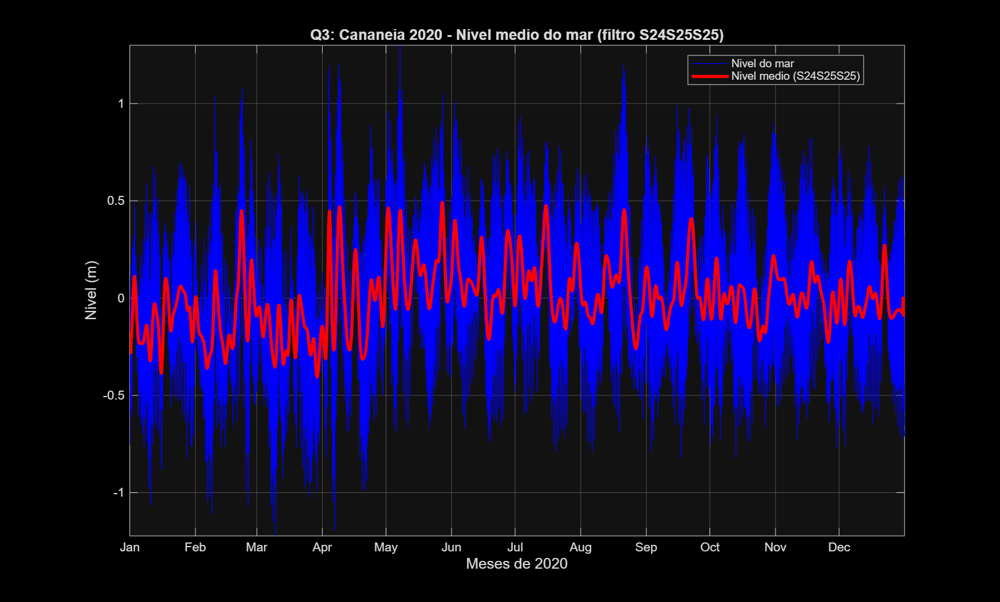

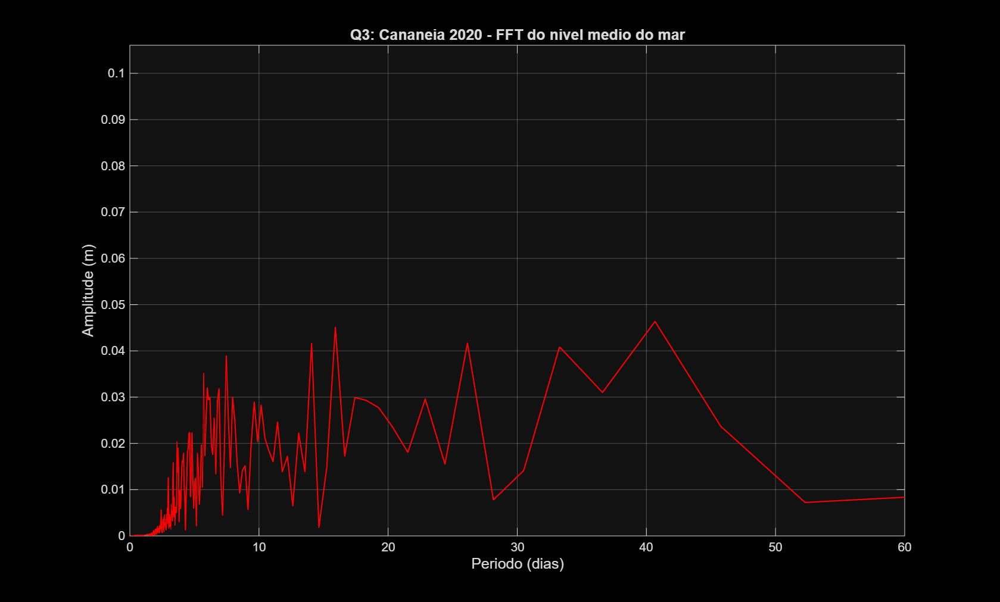

**Comentário:** O filtro S24S25S25 remove eficientemente as oscilações de maré (períodos < 2 dias), revelando variações de nível médio com amplitude de até ~0,49 m. O espectro FFT do nível médio mostra energia nas bandas de 3–30 dias, associadas à passagem de sistemas meteorológicos (frentes frias) e variações sazonais. A distribuição do nível médio é mais simétrica que a do nível bruto, com curtose próxima à normal (3,15).

---

### Questão 4 — Probabilidades de excedência e períodos de retorno

> Calcular as probabilidades de excedência e não excedência, bem como os períodos de retorno (de nível do mar, maré e nível médio do mar).

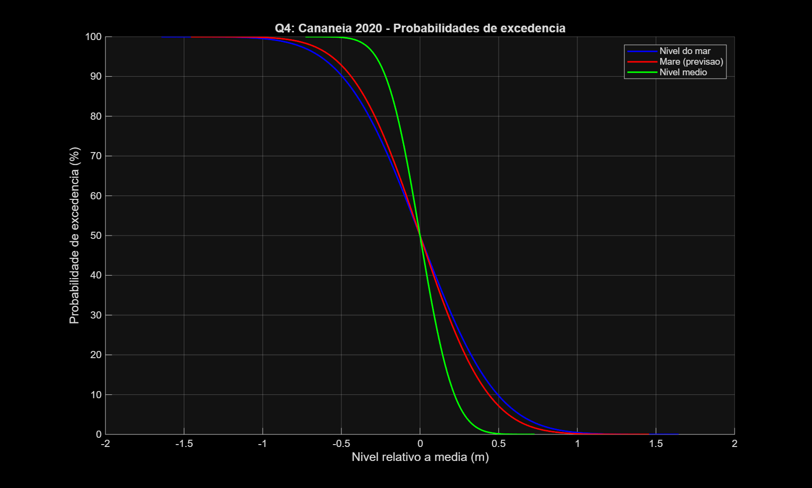

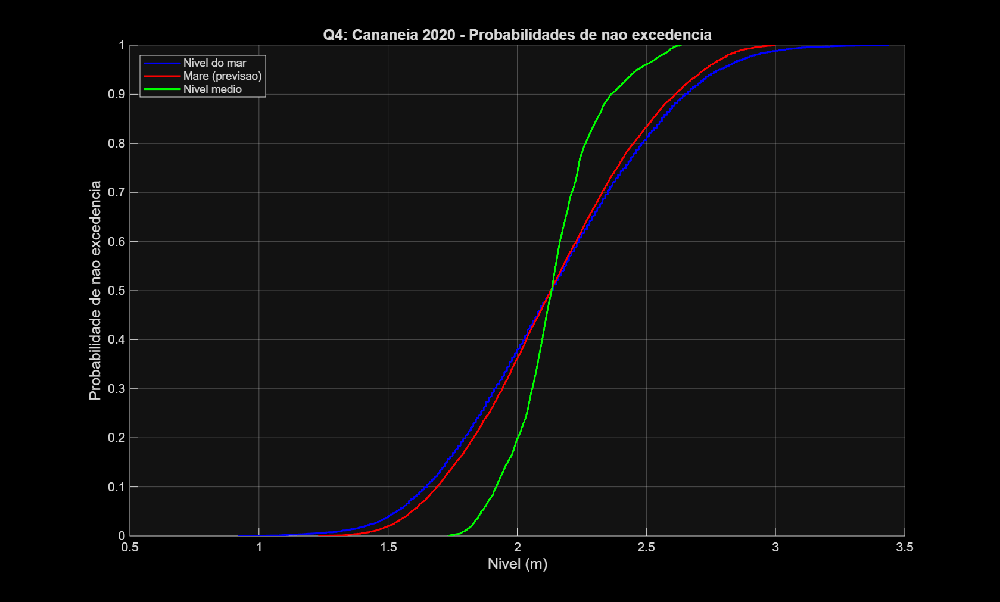

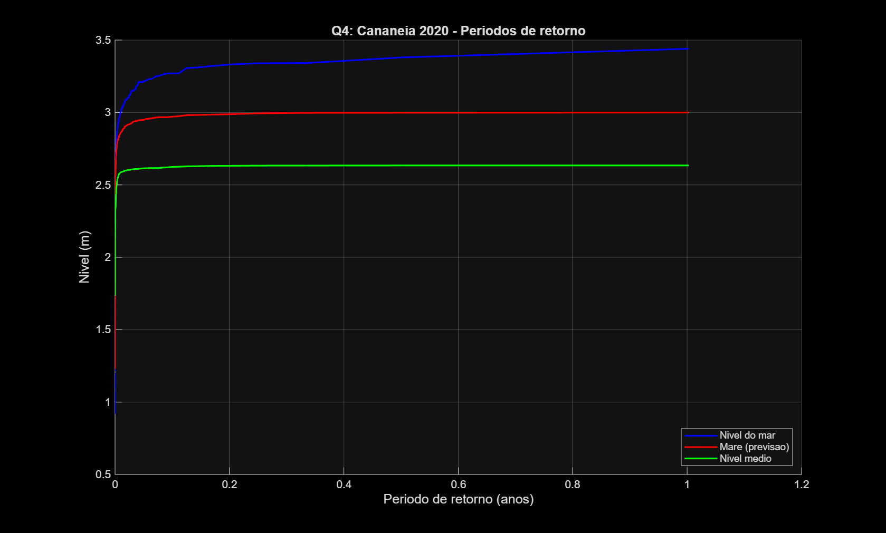

**Níveis associados a períodos de retorno selecionados (Cananéia):**

| Período de retorno | Nível do mar | Maré (previsão) | Nível médio |
|-------------------|:------------:|:---------------:|:-----------:|
| 0,5 ano | 3,3800 m | 2,9981 m | 2,6340 m |
| 1 ano | 3,4400 m | 2,9996 m | 2,6341 m |
| 2 anos | 3,4400 m | 2,9996 m | 2,6341 m |
| 5 anos | 3,4400 m | 2,9996 m | 2,6341 m |
| 10 anos | 3,4400 m | 2,9996 m | 2,6341 m |

**Comentário:** Com apenas 1 ano de dados, os períodos de retorno superiores a ~0,5 ano são extrapolados para um número limitado de eventos extremos, resultando em valores iguais ao máximo observado para T > 1 ano. Para estimativas confiáveis de períodos de retorno longos seria necessária uma série histórica mais extensa. O nível máximo observado em 2020 foi de 3,44 m (com média), associado a evento de maré de sizígia combinado com maré meteorológica positiva.

---

## Parte 2 — Comparação Cananéia vs Ubatuba

---

### Questão 5 — Amplificações/atenuações e atrasos de M2, S2, K1 e O1

> Calcular as amplificações ou atenuações, e os atrasos no tempo, das componentes de maré M2, S2, K1 e O1, entre Cananéia e Ubatuba.

**Análise harmônica — Ubatuba:**
- Variância residual após ajuste: **24,67%** (maré explica 75,33%)
- Variância residual após síntese: **26,78%**

**Tabela comparativa das principais constituintes:**

| Comp. | H Cananéia (m) | G Cananéia (°) | H Ubatuba (m) | G Ubatuba (°) | H_uba / H_can | Atraso (h) |
|-------|:--------------:|:--------------:|:-------------:|:-------------:|:-------------:|:----------:|
| M2 | 0,3596 | 91,17 | 0,3101 | 77,84 | **0,8623** | −0,46 |
| S2 | 0,2418 | 97,81 | 0,1853 | 83,87 | **0,7663** | −0,46 |
| K1 | 0,0575 | 140,79 | 0,0605 | 140,02 | **1,0513** | −0,05 |
| O1 | 0,1039 | 83,22 | 0,1071 | 80,71 | **1,0316** | −0,18 |

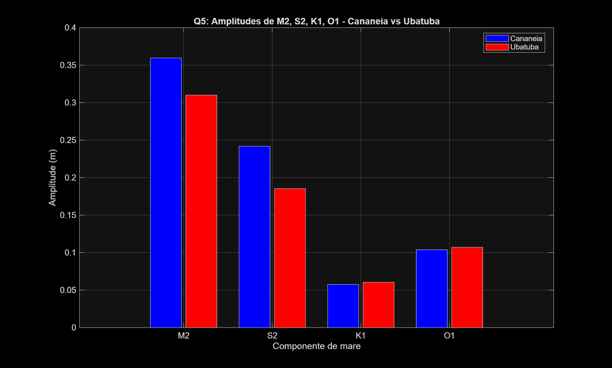

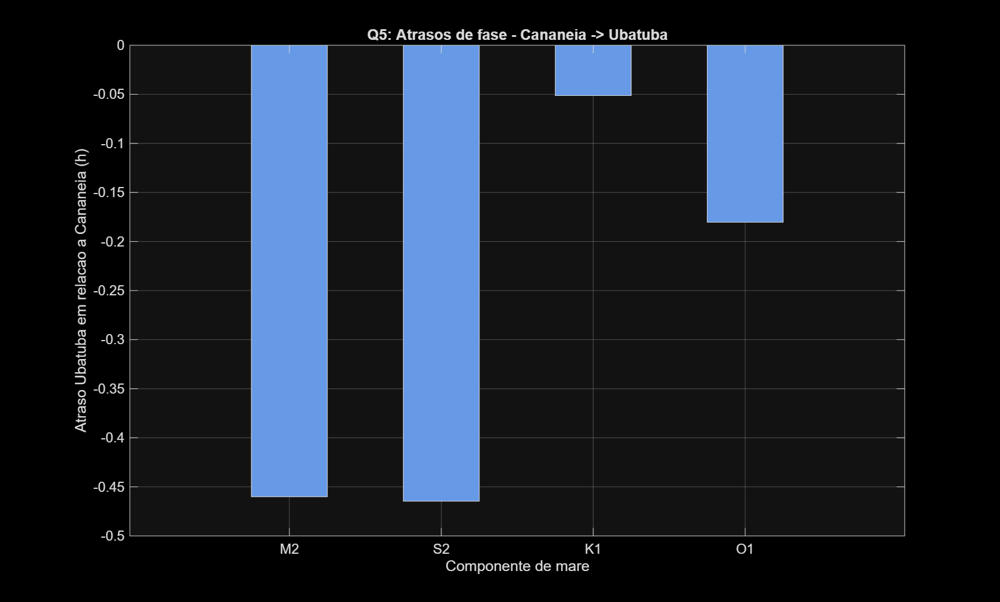

**Comentário:** As constituintes semidiurnas (M2 e S2) mostram **atenuação** em Ubatuba em relação a Cananéia (~14% e ~23%, respectivamente), enquanto as diurnas (K1 e O1) apresentam leve **amplificação** (~5% e ~3%). Os atrasos negativos indicam que Ubatuba **adianta-se** a Cananéia em ~0,46 h para as semidiurnas, o que é fisicamente consistente com a propagação da onda de maré no litoral norte de São Paulo (direção sudeste→nordeste). As diferenças de fase diurnas são pequenas (< 0,2 h).

---

### Questão 6 — Comparação do nível médio do mar

> Comparar as séries de nível médio do mar de Cananéia e Ubatuba, através de plotagens e cálculo de parâmetros comparativos e correlações cruzadas (com defasagens). Comentar os resultados obtidos.

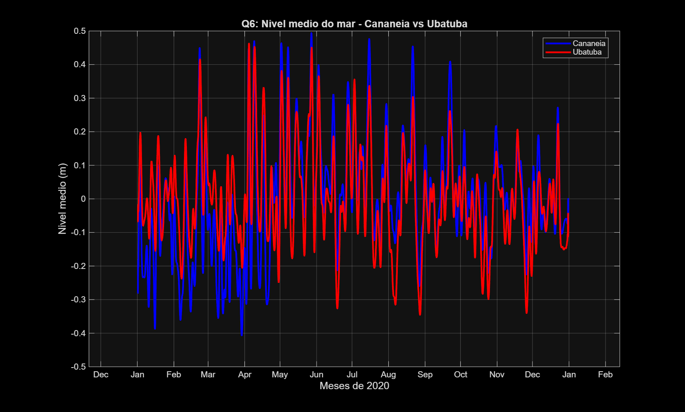

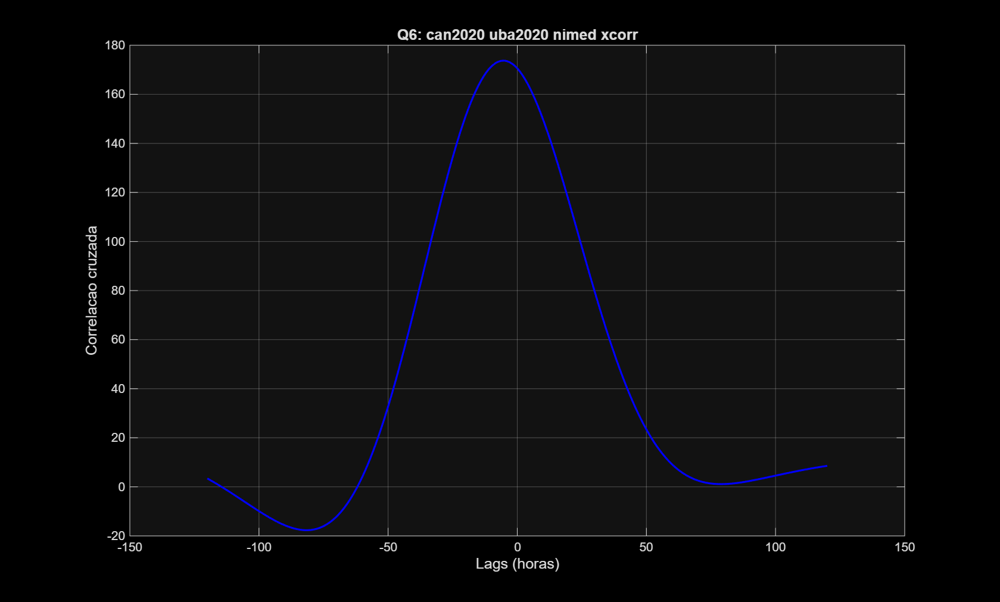

**Parâmetros estatísticos comparativos:**

| Parâmetro | Valor |
|-----------|-------|
| Correlação (r) | 0,7849 |
| R² | 0,6161 |
| Viés (Ubatuba − Cananéia) | ≈ 0,000 m |
| RMSE | 0,1064 m |
| Índice de concordância de Willmott (d) | 0,8757 |
| Máxima correlação cruzada | 0,7993 |
| Defasagem na máxima correlação | −5 h |

**Comentário:** As séries de nível médio apresentam boa correlação (r = 0,785), refletindo o forçamento meteorológico regional comum. O viés é nulo, indicando que as médias de longo prazo são equivalentes após remoção das médias locais. A defasagem de −5 h sugere que os eventos de baixa frequência (passagem de frentes frias) chegam ~5 h mais cedo em Ubatuba. O RMSE de 0,106 m reflete diferenças locais de resposta à forçante meteorológica e às correntes costeiras.

---

## Parte 3 — Correntes em Santos (adp_0m.dat)

---

### Questão 7 — Correntes EW e NS: série, análise harmônica e previsão

> Plotar as séries de componentes de correntes EW e NS, efetuar análise das correntes de maré e fazer previsão de correntes de maré para o período analisado.

**Análise harmônica — Santos (intervalo 30 min, 35 constituintes):**

| Componente | % variância explicada (ajuste) | % variância residual (síntese) |
|------------|:------------------------------:|:------------------------------:|
| EW | 15,12% | 7,73% |
| NS | 32,29% | 28,51% |

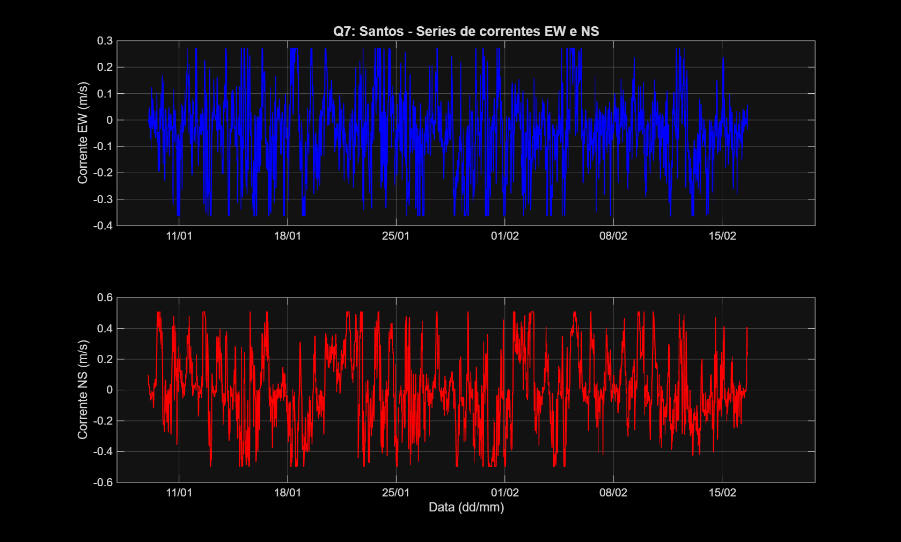

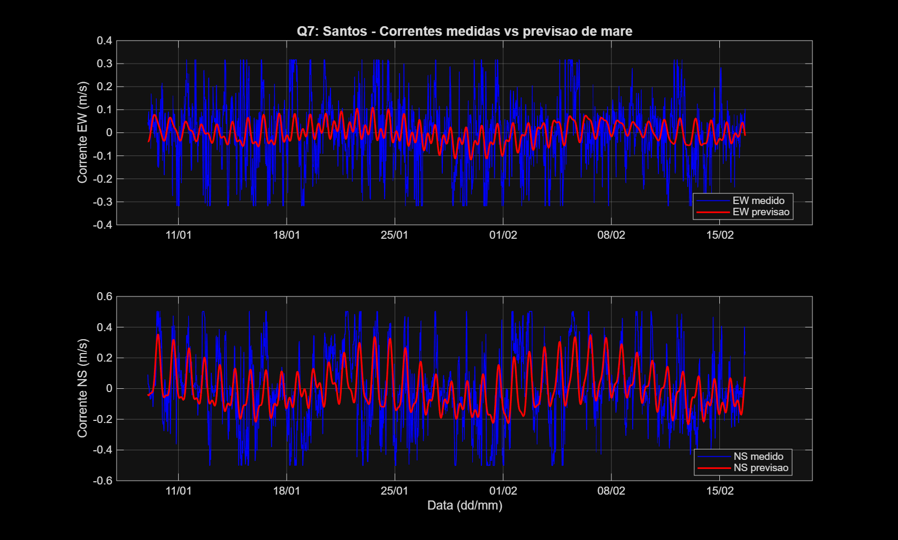

**Comentário:** A maré explica uma fração pequena da variância das correntes em Santos, especialmente na componente EW (< 8%). Isso indica que as correntes locais são fortemente influenciadas por outros processos: correntes geradas pelo vento, correntes de gradiente e estratificação. A componente NS tem explicação ligeiramente melhor pela maré (~28%), sugerindo que a propagação da onda de maré na região tem direção predominantemente norte-sul. A série de apenas ~38 dias limita a resolução de constituintes próximas.

---

### Questão 8 — Elipses de correntes de maré M2, S2, K1 e O1

> Plotar as elipses das componentes de correntes de maré M2, S2, K1 e O1.

**Parâmetros das constituintes (EW e NS separados):**

| Comp. | H_EW (m/s) | G_EW (°) | H_NS (m/s) | G_NS (°) |
|-------|:----------:|:--------:|:----------:|:--------:|
| M2 | 0,0095 | 43,56 | 0,0288 | 59,89 |
| S2 | 0,0159 | 62,25 | 0,0618 | 133,48 |
| K1 | 0,0369 | 223,15 | 0,1278 | 283,45 |
| O1 | 0,0207 | 334,26 | 0,0047 | 197,27 |

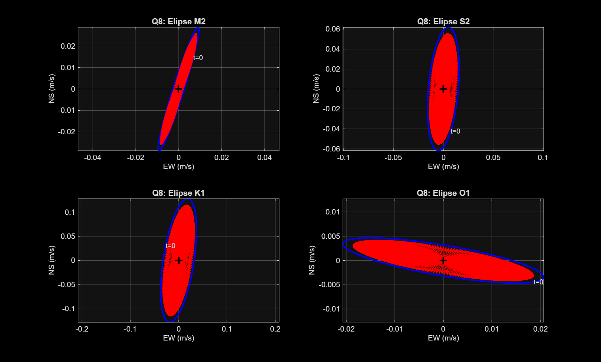

**Comentário:** As elipses mostram que as correntes de maré em Santos são fracas em termos absolutos (amplitudes < 0,13 m/s). As constituintes diurnas K1 e O1 têm eixo principal na direção NS (dominância do eixo norte-sul), enquanto M2 e S2 são relativamente isótropas. A diferença de fase entre EW e NS determina o sentido de rotação da elipse: diferenças próximas de 90° indicam elipses mais circulares (rotação), enquanto diferenças de 0° ou 180° indicam elipses degeneradas em segmentos.

---

### Questão 9 — Séries residuais de correntes EW e NS

> Plotar as séries residuais (medições menos previsão) das componentes de correntes EW e NS.

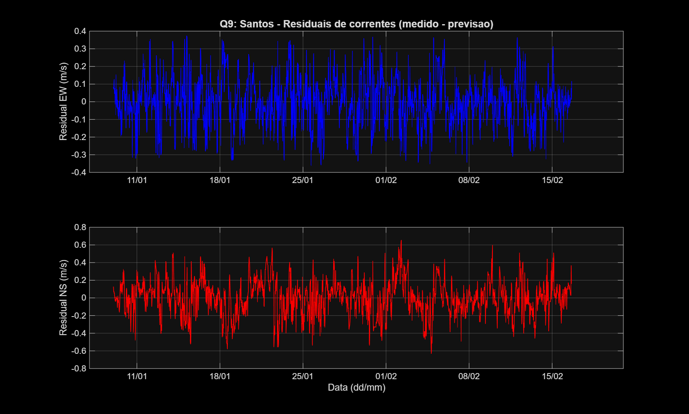

**Estatística dos residuais:**

| Componente | Média (m/s) | Desvio padrão (m/s) | Mínimo (m/s) | Máximo (m/s) |
|------------|:-----------:|:-------------------:|:------------:|:------------:|
| EW | −0,0008 | 0,1390 | −0,3609 | 0,3733 |
| NS | 0,0017 | 0,2045 | −0,6283 | 0,6545 |

**Comentário:** Os residuais são grandes em relação às amplitudes da maré (~0,14–0,20 m/s de DP), confirmando que as correntes em Santos não são dominadas pela maré. Os picos de residual (até ±0,63 m/s na NS) estão associados a eventos de vento intenso ou passagem de frentes. A média próxima de zero em ambas as componentes indica ausência de tendência sistemática na previsão.

---

### Questão 10 — Nível do mar vs temperatura no fundo

> Efetuar comparações com parâmetros estatísticos básicos e relações cruzadas (com defasagens) entre as séries de nível do mar e de temperatura no fundo.

**Estatísticas básicas:**

| Série | Média | Desvio padrão | Mínimo | Máximo |
|-------|:-----:|:-------------:|:------:|:------:|
| Nível do mar | 0,0000 m | 0,3750 m | −1,0483 m | 0,9959 m |
| Temperatura no fundo | 23,77 °C | 1,6938 °C | 20,25 °C | 26,85 °C |

**Correlação:** r = 0,1851 · R² = 0,0343

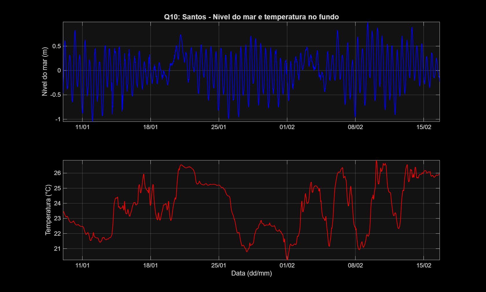

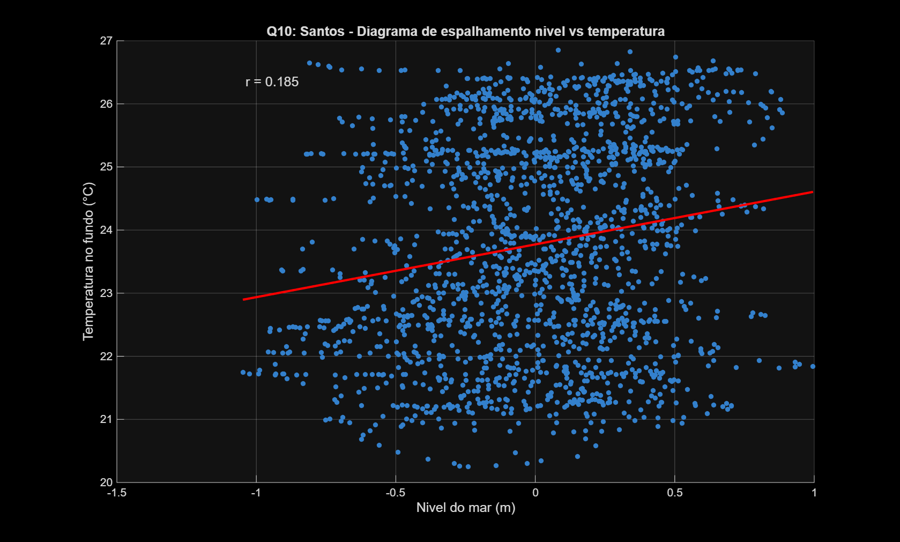

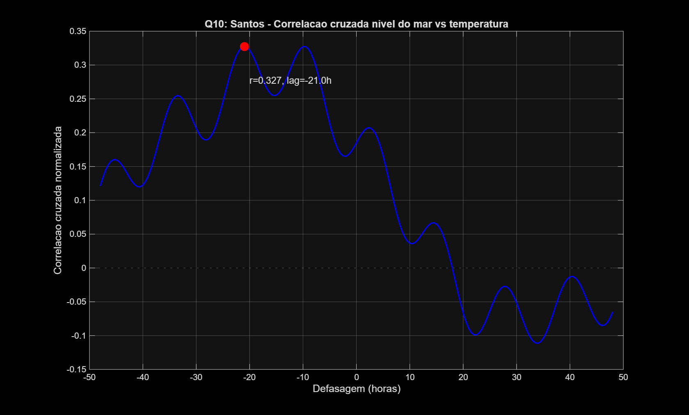

**Máxima correlação cruzada:** r = 0,3274 na defasagem de **−21,0 h** (temperatura adianta o nível em 21 h)

**Comentário:** A correlação direta entre nível e temperatura é baixa (r = 0,185), indicando que o sinal de maré não explica as variações de temperatura no fundo. A correlação cruzada máxima (r = 0,327) ocorre com temperatura adiantando o nível em ~21 h, sugerindo que a intrusão de água mais fria (ressurgência ou advecção costeira) pode preceder ligeiras variações no nível local — fenômeno associado ao vento paralelo à costa (upwelling costeiro). A explicação mais provável é a atuação do vento como forçante comum: eventos de vento NE/NW geram simultaneamente variações de nível (empilhamento/rebaixamento) e mudanças na temperatura do fundo (via advecção ou mistura), porém com defasagens distintas.

---

## Estrutura de arquivos

```
lista-02/
├── amaroc_L2_adriano_caversan.m    # Script MATLAB principal
├── README.md                        # Este arquivo
├── lista-2.txt                      # Enunciado original
├── GUIDE.md                         # Orientações do professor
├── lista-original/
│   ├── Cananeia_2020.dat
│   ├── Ubatuba_2020.dat
│   ├── adp_0m.dat
│   └── exerc_02_amaroc_2026.pdf
├── t_tide/                          # Toolbox t_tide (Pawlowicz et al. 2002)
│   ├── t_tide.m
│   ├── t_predic.m
│   └── ...
├── plot/                            # Figuras geradas (21 PNG)
└── data-tmp/                        # Constantes harmônicas (gitignored)
    ├── cananeia_ctes.dat
    ├── ubatuba_ctes.dat
    └── santos_ctes_*.dat
```

## Como executar

```matlab
% No MATLAB, definir Current Folder como lista-02/ e rodar:
amaroc_L2_adriano_caversan
```

Ou via terminal:
```powershell
matlab -batch "cd('caminho/para/lista-02'); amaroc_L2_adriano_caversan"
```

## Referência

Pawlowicz, R., Beardsley, B., Lentz, S. (2002). Classical tidal harmonic analysis including error estimates in MATLAB using T_TIDE. *Computers & Geosciences*, 28, 929–937.
